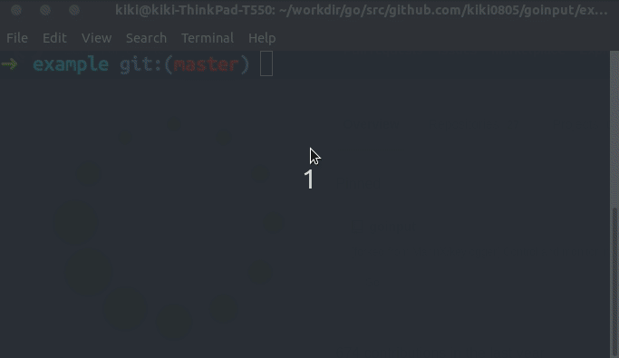

# goinput

Capture mouse and keyboard events or control them on Linux


## Notes
* Only Linux based
* Need root privilages

## Installation

```sh
sudo apt-get install xdotool
go get github.com/kiki0805/goinput
```

### Example

- You can find a example script in `example/main.go`
    - `sudo -E go run main.go`
- The controller depends on `xdotool`. Check https://www.linux.org/threads/xdotool-keyboard.10528/ for its supported keysequence.

## License

This library is under the MIT License
